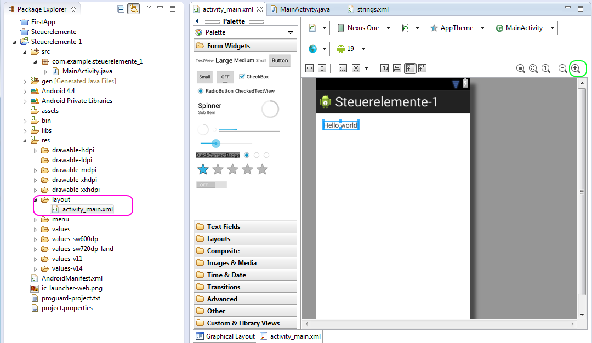
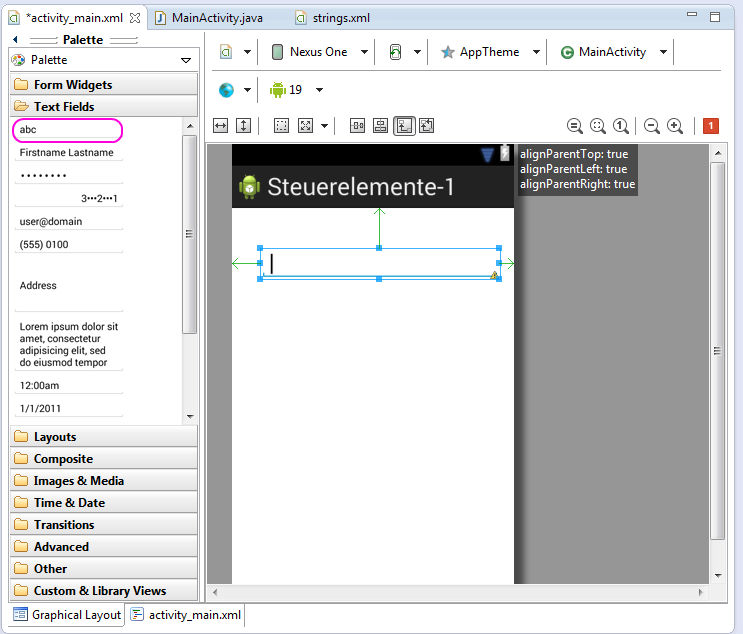
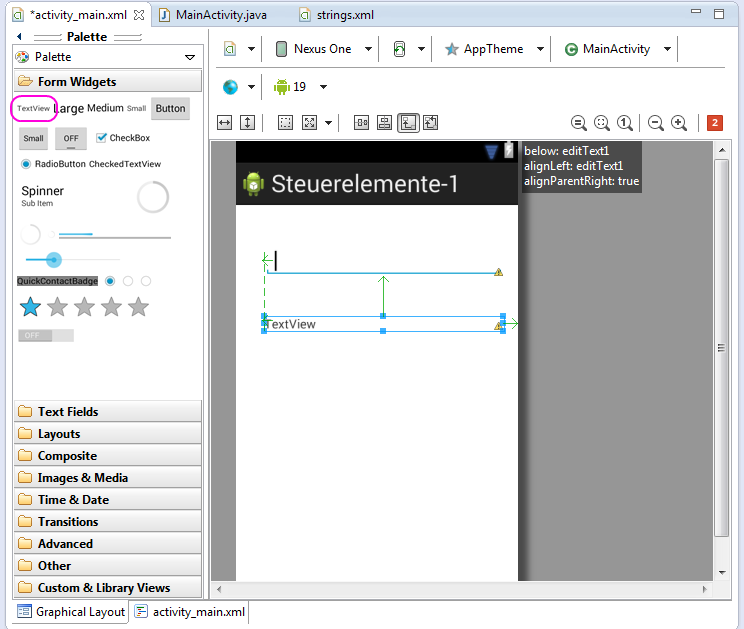
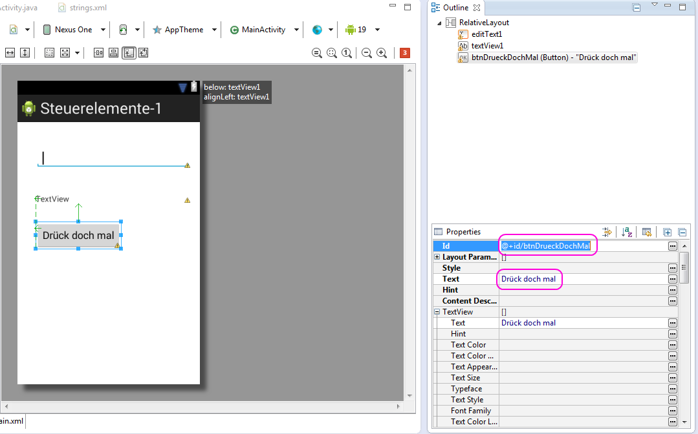
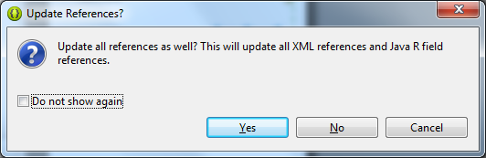
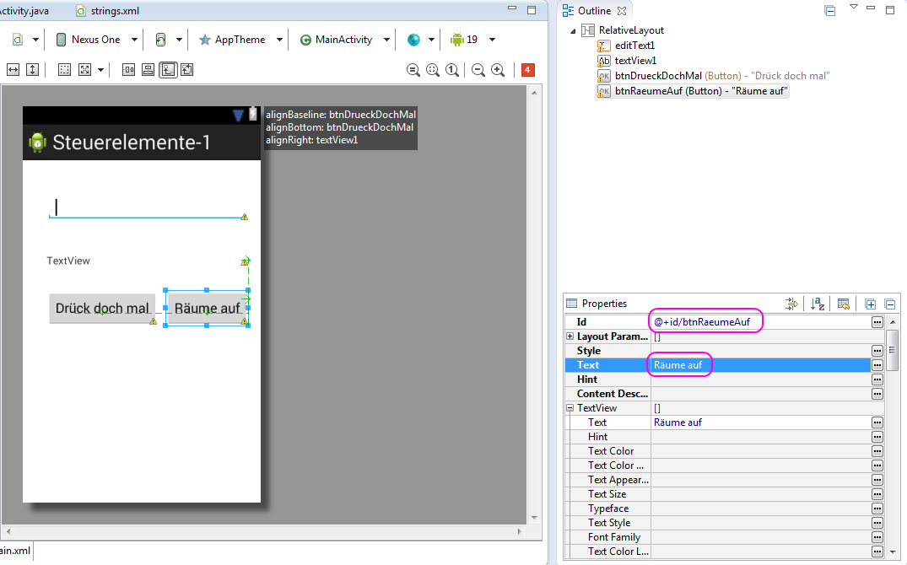

# 3. Steuerelemente einbringen

Hier erfolgen nun die Hinweise zur Erstellung einer Nutzer-Oberfläche.  
Es wird erläutert, wie Steuerelemente ins Layout eingebracht werden und diese individuell umbenannt und beschriftet werden können.

__Hilfestellung__

Zunächst ist ein neues Android-Projekt erstellen.  
Dann wird im Projekt-Verzeichnis zu    
&nbsp;&nbsp;&nbsp;&nbsp;**res/layout/activity_main.xml**  
gewechselt.

Wenn Ihr auf diesen Dateinamen klickt, öffnet sich das 'Graphical Layout'.  



Als nächstes diese 'Hello world!'-TextView per Taste 'Entf' entsorgen.

Nun werden mittels des Oberflächen-Designer

- 1 EditText
- 1 TextView
- 1 Schalter namens 'btnDrueckDochMal'
- 1 Schalter namens 'btnRaeumeAuf'
in die Oberfläche der Activity eingebracht.

Als erstes die pinkfarbene abc-'EditText' aus 'Form Widgets' auf das Layout ziehen.  
Hierzu mit der rechter Maustaste anklicken und die Taste __gedrückt__ halten.  
Nun den Mauszeiger in Richtung Layout bewegen.  
Dort angekommen, kann die rechte Maustaste wieder losgelassen werden.  



Nun die pinkfarbene 'TextView' aus 'Form Widgets' auf das Layout ziehen.



Dann in 'Form Widgets' den 'Button' in der obersten Zeile rechts anvisieren und auf das Layout befördern.  
Wenn Ihr dann auf den Schalter im Layout klickt, werden im 'Properties'-Fenster die Eigenschaften des Schalters sichtbar.  
Dort sind nun die beiden pinkfarben markierten Eigenschaften anzupassen.



Die ursprüngliche __id__ 'button1' ist nach 'btnDrueckDochMal' umzubennen und der ursprüngliche __Text__ mit 'Drück Doch Mal' zu beschriften.

Wozu tun wir das? Weil wir mit dieser App im nächsten Projekt weiter arbeiten werden.

Zwischen durch erscheint dieser Dialog, wo man unbedenklich die Checkbox 'Do not show again' abhaken kann.  
Dann Schalter 'Yes' betätigen. 



Dann den nächsten Schalter hinzufügen.  
Diese wird nach 'btnRaeumeAuf' umbenannt und mit 'Räume auf' beschriftet.



Nach dem Einbringen der Steuerelemente sollte die **activity_main.xml** nun so aussehen:

```xml
<RelativeLayout xmlns:android="http://schemas.android.com/apk/res/android"
    xmlns:tools="http://schemas.android.com/tools"
    android:layout_width="match_parent"
    android:layout_height="match_parent"
    android:paddingBottom="@dimen/activity_vertical_margin"
    android:paddingLeft="@dimen/activity_horizontal_margin"
    android:paddingRight="@dimen/activity_horizontal_margin"
    android:paddingTop="@dimen/activity_vertical_margin"
    tools:context=".MainActivity" >

    <EditText
        android:id="@+id/editText1"
        android:layout_width="wrap_content"
        android:layout_height="wrap_content"
        android:layout_alignParentLeft="true"
        android:layout_alignParentRight="true"
        android:layout_alignParentTop="true"
        android:layout_marginTop="30dp"
        android:ems="10" />

    <TextView
        android:id="@+id/textView1"
        android:layout_width="wrap_content"
        android:layout_height="wrap_content"
        android:layout_alignLeft="@+id/editText1"
        android:layout_alignParentRight="true"
        android:layout_below="@+id/editText1"
        android:layout_marginTop="31dp"
        android:text="TextView" />

    <Button
        android:id="@+id/btnDrueckDochMal"
        android:layout_width="wrap_content"
        android:layout_height="wrap_content"
        android:layout_alignLeft="@+id/textView1"
        android:layout_below="@+id/textView1"
        android:layout_marginTop="30dp"
        android:text="Drück doch mal" />

    <Button
        android:id="@+id/btnRaeumeAuf"
        android:layout_width="wrap_content"
        android:layout_height="wrap_content"
        android:layout_alignBaseline="@+id/btnDrueckDochMal"
        android:layout_alignBottom="@+id/btnDrueckDochMal"
        android:layout_marginLeft="14dp"
        android:layout_toRightOf="@+id/btnDrueckDochMal"
        android:text="Räume auf" />

</RelativeLayout>
```

Das Layout ist nun soweit vorbereitet, das zur nächsten App [4.Steuerelemente auslesen](https://github.com/android-kennenlernen/4.Steuerelemente-auslesen) übergegangen werden kann.


__Was sollten wir nun beherrschen?__

- Einbringen von Steuerelementen
- Vergabe von selbstgewählten Bezeichnern für dieselben